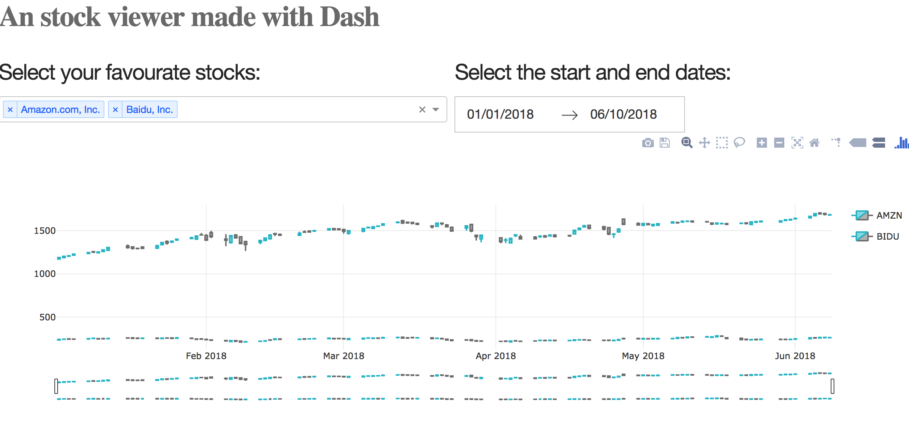

## Demo

See it live [here](https://stock-ticker-2018.herokuapp.com/)

## Overview

A stock viewing app that pulls live stock data from Nasdaq

This app queries live data from The Investors Exchange via Pandas Datareader api and presents the results in candlestick charts with multiple stock quotes feature enabled.

## Technologies used

Python, Pandas-Datareader, Pandas, Plotly.py (Data visualisation), Dash, Pendulum.
